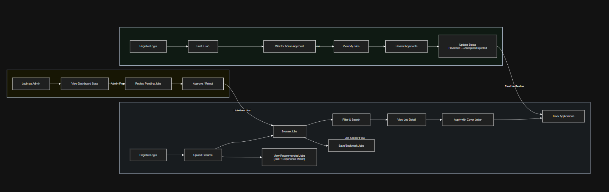
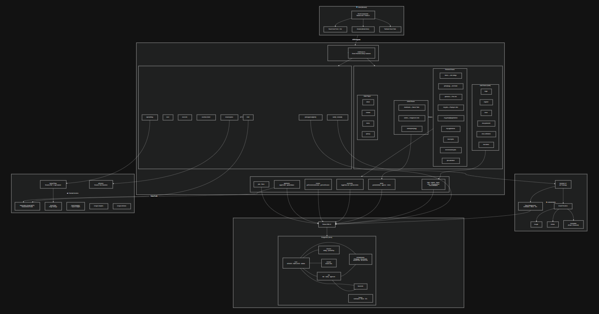
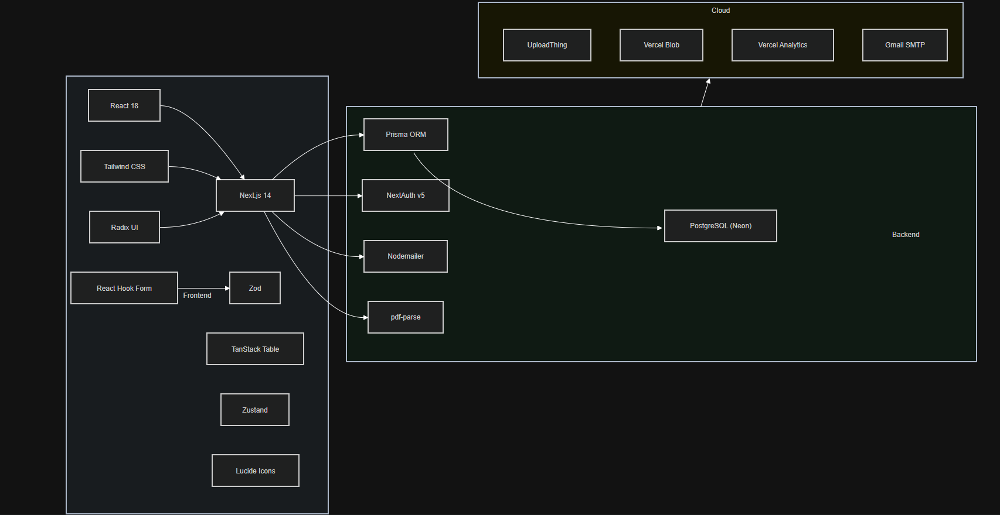
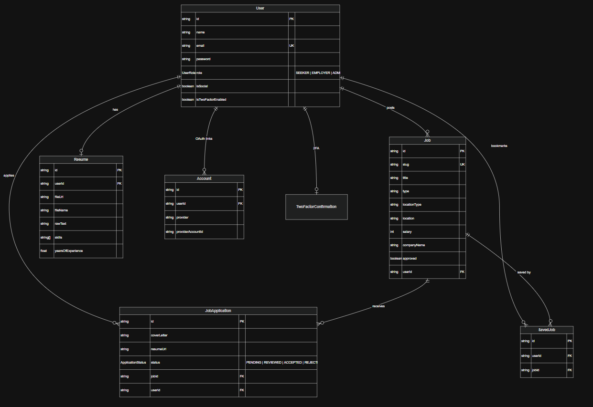

# Rozgar Hub

A full-stack job portal built with Next.js where job seekers can discover opportunities, upload resumes, and track applications — while employers can post jobs, review applicants, and manage hiring pipelines.


---

## Features

### For Job Seekers
- **Smart Job Search** — Filter by title, type, location, salary range, and remote options
- **Resume Upload & Parsing** — Upload a PDF resume; skills and years of experience are auto-extracted
- **AI-Powered Recommendations** — Get job matches ranked by skill overlap and experience level
- **One-Click Apply** — Apply to jobs directly with an optional cover letter and auto-attached resume
- **Application Tracking** — Monitor application status (Pending, Reviewed, Accepted, Rejected)
- **Bookmarks** — Save jobs for later and access them anytime
- **Email Notifications** — Receive email updates when your application status changes

### For Employers
- **Job Posting** — Create detailed job listings with rich text descriptions and company logos
- **Applicant Management** — View all applicants per job, read cover letters, download resumes
- **Status Updates** — Mark applications as Reviewed, Accepted, or Rejected (triggers email to seeker)
- **My Jobs Dashboard** — Track all posted jobs with application counts

### For Admins
- **Admin Dashboard** — Overview stats: total jobs, users, applications, resumes, pending approvals
- **Job Approval** — Review and approve/reject job postings before they go live
- **Recent Activity** — Monitor latest job submissions and applications

### General
- **Authentication** — Email/password, Google, and GitHub OAuth with email verification
- **Two-Factor Authentication** — Optional 2FA via email OTP
- **Role-Based Access** — Seeker, Employer, and Admin roles with route-level gating
- **Responsive Design** — Mobile-first layout with sticky navbar and collapsible filters
- **Analytics** — Google Analytics (GA4) + Vercel Analytics + Speed Insights

---

## Architecture

### User Flow


### System Architecture


### Tech Stack


### ER Diagram


---

## Tech Stack

| Layer | Technology |
|-------|-----------|
| **Framework** | Next.js 14 (App Router, Server Components, Server Actions) |
| **Language** | TypeScript |
| **Database** | PostgreSQL (Neon Serverless) |
| **ORM** | Prisma 5 |
| **Auth** | NextAuth v5 (JWT strategy, Google/GitHub/Credentials providers) |
| **Styling** | Tailwind CSS + Radix UI primitives |
| **Forms** | React Hook Form + Zod validation |
| **File Upload** | UploadThing (resumes & logos) |
| **Email** | Nodemailer (Gmail SMTP) |
| **Resume Parsing** | pdf-parse (text extraction + skill matching) |
| **State** | Zustand (modals), URL params (filters/pagination) |
| **Tables** | TanStack React Table v8 |
| **Rich Text** | React Draft WYSIWYG + React Markdown |
| **Analytics** | Google Analytics GA4, Vercel Analytics |
| **Deployment** | Vercel |

---

## Project Structure

```
rozgar-hub/
├── app/
│   ├── (protected)/           # Auth-gated routes
│   │   ├── home/              # Job listings with filters
│   │   ├── jobs/
│   │   │   ├── [slug]/        # Job detail + apply
│   │   │   └── new/           # Post a job (employer only)
│   │   ├── my-applications/   # Seeker's application tracker
│   │   ├── my-jobs/           # Employer's posted jobs
│   │   │   └── [jobId]/applications/  # View applicants
│   │   ├── saved-jobs/        # Bookmarked jobs
│   │   ├── recommended-jobs/  # AI-matched jobs
│   │   ├── dashboard/         # Admin dashboard with stats
│   │   ├── admin/             # Admin job approval
│   │   ├── about/
│   │   ├── contact/
│   │   ├── terms/
│   │   └── privacy/
│   ├── auth/                  # Login, register, reset, 2FA
│   └── api/
│       ├── auth/[...nextauth]/ # NextAuth handler
│       ├── jobs/approval/      # Job approval endpoint
│       ├── resume/parse/       # Resume parsing
│       ├── mail/               # Contact form email
│       └── uploadthing/        # File upload
├── actions/                   # Server actions
│   ├── application.action.ts  # Apply, track, update status
│   ├── admin.action.ts        # Dashboard stats
│   ├── jobs.action.ts         # Job CRUD
│   ├── filters.action.ts      # Job search & filtering
│   ├── resume.action.ts       # Resume & recommendations
│   ├── saved-jobs.action.ts   # Bookmark toggle
│   ├── login.action.ts        # Auth actions
│   ├── register.action.ts
│   └── ...
├── components/
│   ├── auth/                  # Login/register forms, OAuth buttons
│   ├── dashboard/             # Admin data table
│   ├── my-applications/       # Seeker table columns
│   ├── my-jobs/               # Employer table columns + status dropdown
│   ├── contactForm/           # Contact form with subject picker
│   ├── modals/                # Role picker, profile, 2FA, resume upload
│   ├── ui/                    # shadcn/ui primitives
│   ├── Navbar.tsx
│   ├── Footer.tsx
│   ├── JobListItem.tsx
│   ├── JobResults.tsx
│   ├── JobFilterSidebar.tsx
│   ├── JobPage.tsx
│   ├── ApplyJobButton.tsx
│   ├── BookmarkButton.tsx
│   ├── StatusBadge.tsx
│   ├── EmptyState.tsx
│   └── GoogleAnalytics.tsx
├── lib/
│   ├── prisma.ts              # Prisma client singleton
│   ├── auth.ts                # getCurrentUser helper
│   ├── mail.ts                # Email templates
│   ├── tokens.ts              # Verification/reset token generation
│   ├── validation.ts          # Zod schemas
│   ├── job-types.ts           # Job type constants
│   ├── cities-list.ts         # Location autocomplete data
│   └── skills-dictionary.ts   # Skills reference for matching
├── prisma/
│   └── schema.prisma          # Database schema
├── hooks/
│   ├── use-debounce.ts
│   └── use-modal-store.ts
├── middleware.ts               # Route protection
├── auth.ts                     # NextAuth config
└── auth.config.ts              # Auth providers
```

---

## Database Schema

```
User ──< Job ──< JobApplication >── User
  │                    │
  │── Resume           │── SavedJob >── User
  │── Account
  │── TwoFactorConfirmation
```

**Models:** User (3 roles), Job, JobApplication (4 statuses), Resume (skills + experience), SavedJob, Account (OAuth), VerificationToken, PasswordResetToken, TwoFactorToken

---

## Getting Started

### Prerequisites

- Node.js 18+
- PostgreSQL database (or a [Neon](https://neon.tech) account)
- Google & GitHub OAuth credentials
- Gmail account for sending emails (with App Password)
- [UploadThing](https://uploadthing.com) account for file uploads

### 1. Clone the repository

```bash
git clone https://github.com/nimish-sikri/rozgar-hub.git
cd rozgar-hub
```

### 2. Install dependencies

```bash
npm install
```

### 3. Set up environment variables

Create a `.env` file in the root directory:

```env
# Database (Neon PostgreSQL)
POSTGRES_PRISMA_URL=your_pooled_connection_string
POSTGRES_URL_NON_POOLING=your_direct_connection_string

# NextAuth
AUTH_SECRET=your_random_secret_here

# Google OAuth
GOOGLE_CLIENT_ID=your_google_client_id
GOOGLE_CLIENT_SECRET=your_google_client_secret

# GitHub OAuth
GITHUB_CLIENT_ID=your_github_client_id
GITHUB_CLIENT_SECRET=your_github_client_secret

# Email (Gmail SMTP)
NODEMAILER_EMAIL=your_gmail@gmail.com
NODEMAILER_PIN=your_gmail_app_password

# UploadThing
UPLOADTHING_SECRET=your_uploadthing_secret
UPLOADTHING_APP_ID=your_uploadthing_app_id

# App URL
NEXT_PUBLIC_PRODUCTION_URL=http://localhost:3000
```

### 4. Set up the database

```bash
npx prisma db push
npx prisma generate
```

### 5. Run the development server

```bash
npm run dev
```

Open [http://localhost:3000](http://localhost:3000) in your browser.

---

## Deployment

The app is optimized for [Vercel](https://vercel.com):

1. Push your code to GitHub
2. Import the repo in Vercel
3. Add all environment variables in Vercel's project settings
4. Vercel auto-detects Next.js and deploys

The `postinstall` script automatically runs `prisma generate` during deployment.

---

## Author

**Nimish Sikri**

- GitHub: [@nimish-sikri](https://github.com/nimish-sikri)
- LinkedIn: [Nimish Sikri](https://www.linkedin.com/in/nimish-sikri-661635125/)

---

## License

This project is licensed under the ISC License.
