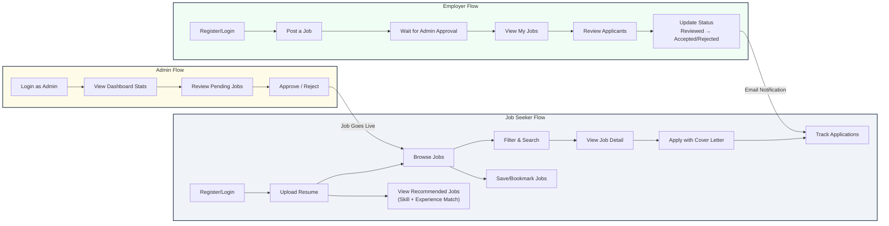
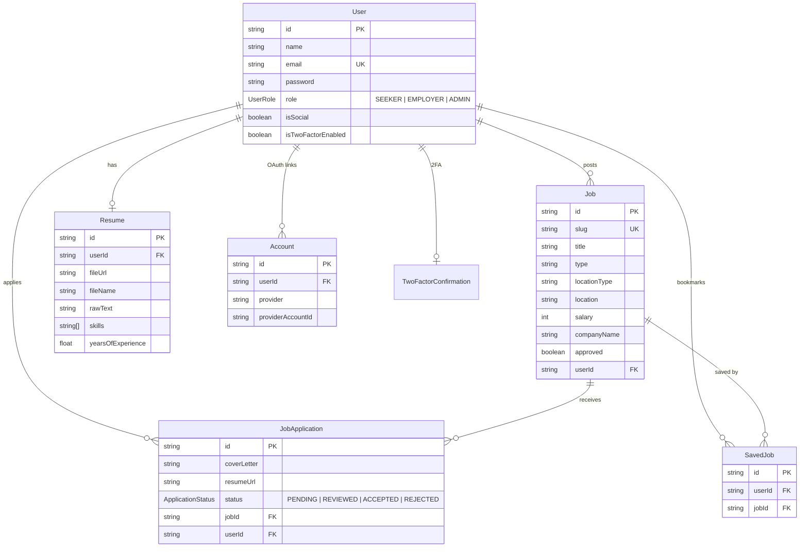
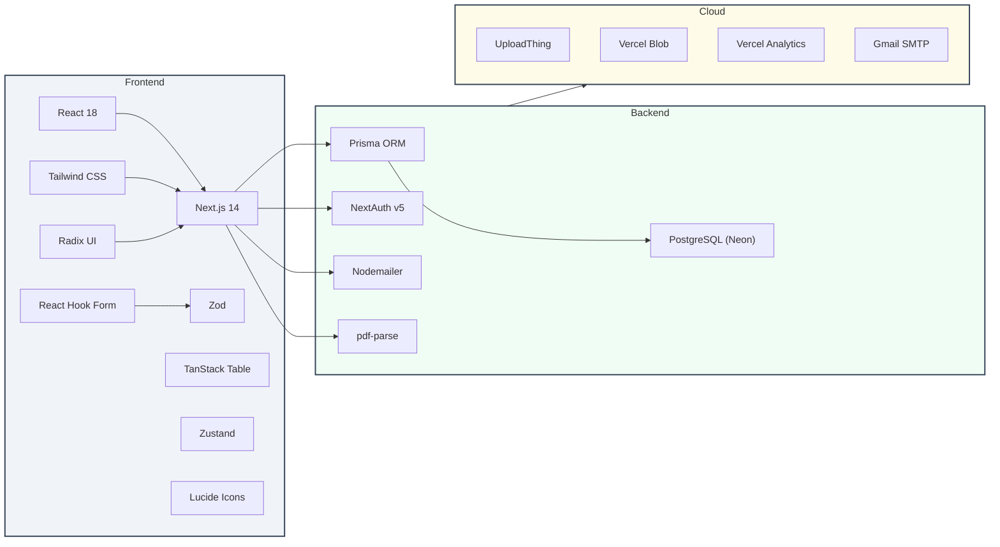

# Rozgar Hub — System Architecture

```mermaid
graph TB
    %% ──────────────── CLIENT LAYER ────────────────
    subgraph CLIENT["🖥️ Client (Browser)"]
        direction TB
        UI["React Components<br/>Tailwind CSS + Radix UI"]
        Forms["React Hook Form + Zod"]
        State["Zustand (Modal Store)"]
        Table["TanStack React Table"]
    end

    %% ──────────────── NEXT.JS APP ────────────────
    subgraph NEXTJS["⚡ Next.js 14 App Router"]
        direction TB

        subgraph MIDDLEWARE["Middleware Layer"]
            MW["middleware.ts<br/>Route Protection & Redirects"]
        end

        subgraph PAGES["Pages & Routes"]
            direction TB
            subgraph AUTH_PAGES["Auth Routes (/auth)"]
                LOGIN["/login"]
                REGISTER["/register"]
                RESET["/reset"]
                NEWPASS["/new-password"]
                VERIFY["/new-verification"]
                TWOFA["/two-factor"]
            end

            subgraph PROTECTED["Protected Routes"]
                HOME["/home — Job Listings"]
                JOBDETAIL["/jobs/[slug] — Job Detail"]
                NEWJOB["/jobs/new — Post Job"]
                MYJOBS["/my-jobs — Employer Jobs"]
                JOBAPPS["/my-jobs/[id]/applications"]
                MYAPPS["/my-applications"]
                SAVED["/saved-jobs"]
                RECOMMENDED["/recommended-jobs"]
                SUBMITTED["/job-submitted"]
            end

            subgraph ADMIN_PAGES["Admin Routes"]
                DASHBOARD["/dashboard — Stats & Table"]
                ADMIN_LIST["/admin — Unapproved Jobs"]
                ADMIN_JOB["/admin/jobs/[slug]"]
            end

            subgraph STATIC["Static Pages"]
                ABOUT["/about"]
                CONTACT["/contact"]
                TERMS["/terms"]
                PRIVACY["/privacy"]
            end
        end

        subgraph API["API Routes (/api)"]
            AUTH_API["/auth/[...nextauth]"]
            USER_API["/user"]
            ROLE_API["/user-role"]
            TWOFA_API["/user/two-factor"]
            APPROVAL_API["/jobs/approval/[jobId]"]
            UPLOAD_API["/uploadthing"]
            RESUME_API["/resume/parse"]
            MAIL_API["/mail"]
        end

        subgraph ACTIONS["Server Actions"]
            direction TB
            AUTH_ACTIONS["login · register · logout<br/>reset · new-password<br/>new-verification"]
            JOB_ACTIONS["jobs · filters"]
            APP_ACTIONS["application<br/>applyToJob · updateStatus"]
            RESUME_ACTIONS["resume<br/>getRecommendedJobs · getUserResume"]
            SAVED_ACTIONS["saved-jobs<br/>toggleSaveJob · getSavedJobs"]
            ADMIN_ACTIONS["admin<br/>getAdminStats · approve · delete"]
        end
    end

    %% ──────────────── AUTH SYSTEM ────────────────
    subgraph AUTH_SYS["🔐 Authentication"]
        direction TB
        NEXTAUTH["NextAuth v5<br/>JWT Strategy"]
        PROVIDERS["OAuth Providers"]
        GOOGLE["Google"]
        GITHUB["GitHub"]
        CREDS["Credentials<br/>(Email + Password)"]
        TOKENS["Token Management<br/>Verification · Reset · 2FA"]
    end

    %% ──────────────── DATA LAYER ────────────────
    subgraph DATA["🗄️ Data Layer"]
        direction TB
        PRISMA["Prisma ORM v5"]
        subgraph DB["PostgreSQL (Neon)"]
            direction LR
            USER_T["User<br/>SEEKER · EMPLOYER · ADMIN"]
            JOB_T["Job<br/>title · salary · approved"]
            APP_T["JobApplication<br/>PENDING · REVIEWED<br/>ACCEPTED · REJECTED"]
            RESUME_T["Resume<br/>skills[] · yearsOfExp"]
            SAVED_T["SavedJob"]
            ACCOUNT_T["Account<br/>OAuth Links"]
            VERF_T["Tokens<br/>Verification · Reset · 2FA"]
        end
    end

    %% ──────────────── EXTERNAL SERVICES ────────────────
    subgraph EXTERNAL["☁️ External Services"]
        direction TB
        UPLOADTHING["UploadThing<br/>Resume PDF + Logo Upload"]
        NODEMAILER["Nodemailer (Gmail SMTP)<br/>Transactional Emails"]
        VERCEL_BLOB["Vercel Blob<br/>Image Storage"]
        VERCEL_ANALYTICS["Vercel Analytics<br/>+ Speed Insights"]
        GA["Google Analytics"]
        ADSENSE["Google AdSense"]
        PDFPARSE["pdf-parse<br/>Resume Text Extraction"]
    end

    %% ──────────────── CONNECTIONS ────────────────

    %% Client → Next.js
    CLIENT -->|"HTTP Requests"| MIDDLEWARE
    MW --> PAGES
    MW --> API
    UI --> Forms
    UI --> State
    UI --> Table

    %% Pages → Actions
    PROTECTED --> ACTIONS
    ADMIN_PAGES --> ADMIN_ACTIONS
    AUTH_PAGES --> AUTH_ACTIONS

    %% Actions → Data
    JOB_ACTIONS --> PRISMA
    APP_ACTIONS --> PRISMA
    RESUME_ACTIONS --> PRISMA
    SAVED_ACTIONS --> PRISMA
    ADMIN_ACTIONS --> PRISMA
    AUTH_ACTIONS --> PRISMA
    PRISMA --> DB

    %% Auth flow
    AUTH_API --> NEXTAUTH
    NEXTAUTH --> PROVIDERS
    PROVIDERS --> GOOGLE
    PROVIDERS --> GITHUB
    PROVIDERS --> CREDS
    NEXTAUTH --> TOKENS
    TOKENS --> PRISMA

    %% API → External
    UPLOAD_API --> UPLOADTHING
    RESUME_API --> PDFPARSE
    MAIL_API --> NODEMAILER
    APP_ACTIONS -->|"Status Emails"| NODEMAILER
    APPROVAL_API --> PRISMA

    %% External connections
    UPLOADTHING --> VERCEL_BLOB

    %% Relationships
    USER_T --- JOB_T
    USER_T --- APP_T
    USER_T --- RESUME_T
    USER_T --- SAVED_T
    USER_T --- ACCOUNT_T
    JOB_T --- APP_T
    JOB_T --- SAVED_T

    %% Styling
    classDef client fill:#f8f9fa,stroke:#343a40,stroke-width:2px,color:#212529
    classDef nextjs fill:#fff,stroke:#0070f3,stroke-width:2px,color:#212529
    classDef auth fill:#fff,stroke:#6c5ce7,stroke-width:2px,color:#212529
    classDef data fill:#fff,stroke:#00b894,stroke-width:2px,color:#212529
    classDef external fill:#fff,stroke:#e17055,stroke-width:2px,color:#212529
    classDef page fill:#e8f4f8,stroke:#2d3436,stroke-width:1px,color:#212529
    classDef action fill:#ffeaa7,stroke:#2d3436,stroke-width:1px,color:#212529
    classDef api fill:#dfe6e9,stroke:#2d3436,stroke-width:1px,color:#212529

    class CLIENT client
    class NEXTJS nextjs
    class AUTH_SYS auth
    class DATA data
    class EXTERNAL external
    class LOGIN,REGISTER,RESET,NEWPASS,VERIFY,TWOFA,HOME,JOBDETAIL,NEWJOB,MYJOBS,JOBAPPS,MYAPPS,SAVED,RECOMMENDED,SUBMITTED,DASHBOARD,ADMIN_LIST,ADMIN_JOB,ABOUT,CONTACT,TERMS,PRIVACY page
    class AUTH_ACTIONS,JOB_ACTIONS,APP_ACTIONS,RESUME_ACTIONS,SAVED_ACTIONS,ADMIN_ACTIONS action
    class AUTH_API,USER_API,ROLE_API,TWOFA_API,APPROVAL_API,UPLOAD_API,RESUME_API,MAIL_API api
```

---

## User Flow Diagram

```mermaid
flowchart LR
    subgraph SEEKER["Job Seeker Flow"]
        direction TB
        S1["Register/Login"] --> S2["Upload Resume"]
        S2 --> S3["Browse Jobs"]
        S3 --> S4["Filter & Search"]
        S4 --> S5["View Job Detail"]
        S5 --> S6["Apply with Cover Letter"]
        S6 --> S7["Track Applications"]
        S2 --> S8["View Recommended Jobs<br/>(Skill + Experience Match)"]
        S3 --> S9["Save/Bookmark Jobs"]
    end

    subgraph EMPLOYER["Employer Flow"]
        direction TB
        E1["Register/Login"] --> E2["Post a Job"]
        E2 --> E3["Wait for Admin Approval"]
        E3 --> E4["View My Jobs"]
        E4 --> E5["Review Applicants"]
        E5 --> E6["Update Status<br/>Reviewed → Accepted/Rejected"]
        E6 -->|"Email Notification"| S7
    end

    subgraph ADMIN["Admin Flow"]
        direction TB
        A1["Login as Admin"] --> A2["View Dashboard Stats"]
        A2 --> A3["Review Pending Jobs"]
        A3 --> A4["Approve / Reject"]
        A4 -->|"Job Goes Live"| S3
    end

    style SEEKER fill:#f0f4f8,stroke:#334155,stroke-width:2px
    style EMPLOYER fill:#f0fdf4,stroke:#334155,stroke-width:2px
    style ADMIN fill:#fefce8,stroke:#334155,stroke-width:2px
```

---

## Data Model Diagram

```mermaid
erDiagram
    User ||--o{ Job : "posts"
    User ||--o{ JobApplication : "applies"
    User ||--o| Resume : "has"
    User ||--o{ SavedJob : "bookmarks"
    User ||--o{ Account : "OAuth links"
    User ||--o| TwoFactorConfirmation : "2FA"
    Job ||--o{ JobApplication : "receives"
    Job ||--o{ SavedJob : "saved by"

    User {
        string id PK
        string name
        string email UK
        string password
        UserRole role "SEEKER | EMPLOYER | ADMIN"
        boolean isSocial
        boolean isTwoFactorEnabled
    }

    Job {
        string id PK
        string slug UK
        string title
        string type
        string locationType
        string location
        int salary
        string companyName
        boolean approved
        string userId FK
    }

    JobApplication {
        string id PK
        string coverLetter
        string resumeUrl
        ApplicationStatus status "PENDING | REVIEWED | ACCEPTED | REJECTED"
        string jobId FK
        string userId FK
    }

    Resume {
        string id PK
        string userId FK
        string fileUrl
        string fileName
        string rawText
        string[] skills
        float yearsOfExperience
    }

    SavedJob {
        string id PK
        string userId FK
        string jobId FK
    }

    Account {
        string id PK
        string userId FK
        string provider
        string providerAccountId
    }
```

---

## Tech Stack

```mermaid
graph LR
    subgraph Frontend
        REACT["React 18"] --> NEXT["Next.js 14"]
        TW["Tailwind CSS"] --> NEXT
        RADIX["Radix UI"] --> NEXT
        RHF["React Hook Form"] --> ZOD["Zod"]
        TANSTACK["TanStack Table"]
        ZUSTAND["Zustand"]
        LUCIDE["Lucide Icons"]
    end

    subgraph Backend
        NEXT --> PRISMA2["Prisma ORM"]
        NEXT --> NEXTAUTH2["NextAuth v5"]
        PRISMA2 --> PG["PostgreSQL (Neon)"]
        NEXT --> NODEMAILER2["Nodemailer"]
        NEXT --> PDFPARSE2["pdf-parse"]
    end

    subgraph Cloud
        UT["UploadThing"]
        VB["Vercel Blob"]
        VA["Vercel Analytics"]
        GMAIL["Gmail SMTP"]
    end

    Backend --> Cloud

    style Frontend fill:#f0f4f8,stroke:#334155,stroke-width:2px
    style Backend fill:#f0fdf4,stroke:#334155,stroke-width:2px
    style Cloud fill:#fefce8,stroke:#334155,stroke-width:2px
```
